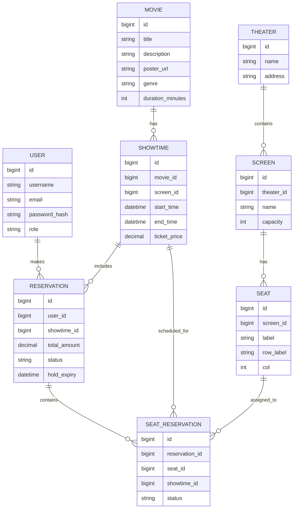
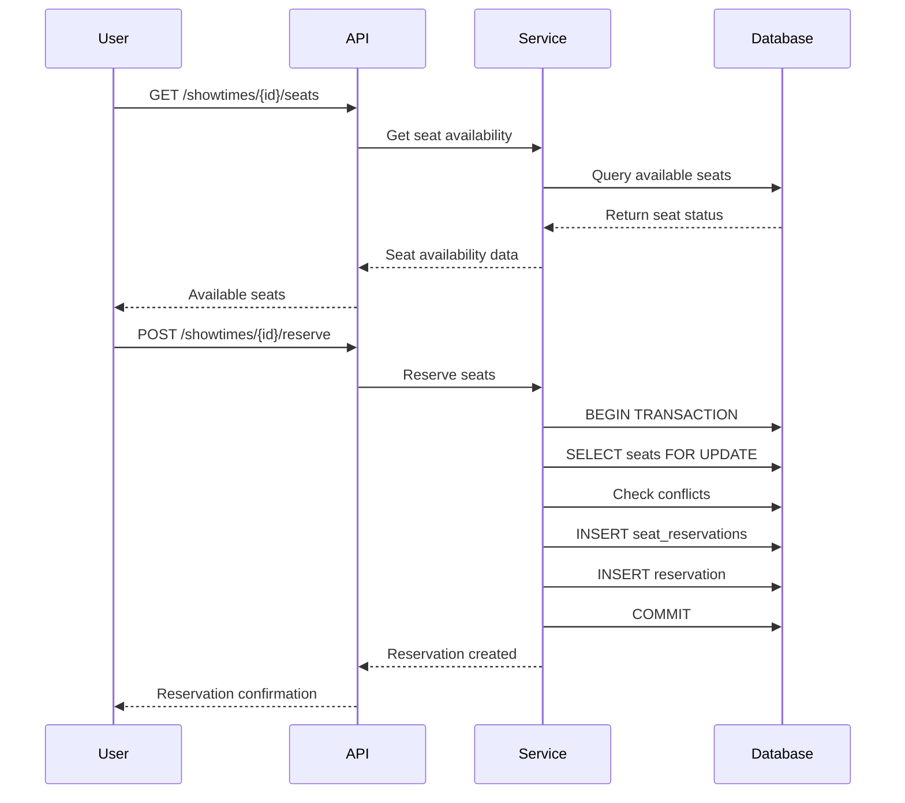

# 🎬 Movie Reservation System

<div align="center">


**A robust, enterprise-grade movie ticket reservation system built with Spring Boot**

[](https://opensource.org/licenses/MIT)
[](https://github.com/yourusername/movie-reservation-system)

</div>

---

## 📋 Table of Contents

- [🎯 Project Overview](#-project-overview)
- [✨ Key Features](#-key-features)
- [🏗 Architecture & Design](#-architecture--design)
- [🛠 Technology Stack](#-technology-stack)
- [📊 Database Schema](#-database-schema)
- [🔐 Security Implementation](#-security-implementation)
- [🚀 Getting Started](#-getting-started)
- [📡 API Documentation](#-api-documentation)
- [🧪 Testing Strategy](#-testing-strategy)
- [📈 Performance & Scalability](#-performance--scalability)
- [🤝 Contributing](#-contributing)
- [📄 License](#-license)

---

## 🎯 Project Overview

The **Movie Reservation System** is a comprehensive backend service designed to handle movie ticket reservations with enterprise-level reliability and scalability. Built with modern Java technologies, this system demonstrates advanced software engineering practices including concurrent seat reservation handling, robust authentication, and comprehensive data management.

### 🎪 Business Domain

This system manages the complete lifecycle of movie ticket reservations:

- **Movie Management**: CRUD operations for movies with metadata
- **Theater & Screen Management**: Multi-theater support with flexible seating configurations
- **Showtime Scheduling**: Dynamic scheduling with pricing strategies
- **Seat Reservation**: Real-time seat availability with concurrency control
- **User Management**: Secure authentication and role-based access control
- **Reservation Processing**: Complete booking workflow from selection to confirmation

---

## ✨ Key Features

### 🔐 **Advanced Security**

- JWT-based authentication with token blacklisting
- Role-based access control (User/Admin)
- Password encryption with BCrypt
- Comprehensive input validation and sanitization

### ⚡ **Concurrency Control**

- Pessimistic locking for seat reservations
- Database-level constraints preventing double bookings
- Transactional integrity across all operations
- Automatic reservation expiry handling

### 📊 **Real-time Management**

- Live seat availability tracking
- Dynamic pricing per showtime
- Comprehensive admin dashboard
- Real-time reservation status updates

### 🏗 **Scalable Architecture**

- Layered architecture with clear separation of concerns
- Repository pattern for data access
- Service layer for business logic
- RESTful API design with proper HTTP status codes

### 🔄 **Data Integrity**

- Database migrations with Flyway
- Comprehensive error handling
- Audit trails with timestamps
- Referential integrity constraints

---

## 🏗 Architecture & Design

### **System Architecture**

```
┌─────────────────┐    ┌─────────────────┐    ┌─────────────────┐
│   Client Apps   │    │   Admin Panel   │    │   Mobile Apps   │
└─────────┬───────┘    └─────────┬───────┘    └─────────┬───────┘
          │                      │                      │
          └──────────────────────┼──────────────────────┘
                                 │
                    ┌─────────────▼─────────────┐
                    │    Spring Boot API        │
                    │  ┌─────────────────────┐  │
                    │  │   Controllers       │  │
                    │  └─────────┬───────────┘  │
                    │  ┌─────────▼───────────┐  │
                    │  │   Services          │  │
                    │  └─────────┬───────────┘  │
                    │  ┌─────────▼───────────┐  │
                    │  │  Repositories       │  │
                    │  └─────────┬───────────┘  │
                    └────────────┼─────────────┘
                                 │
                    ┌─────────────▼─────────────┐
                    │     PostgreSQL DB         │
                    └───────────────────────────┘
```

### **Design Patterns Implemented**

- **Repository Pattern**: Abstract data access layer
- **Service Layer Pattern**: Business logic encapsulation
- **DTO Pattern**: Data transfer objects for API communication
- **Builder Pattern**: Complex object construction
- **Strategy Pattern**: Different pricing strategies
- **Observer Pattern**: Event-driven architecture

---

## 🛠 Technology Stack

### **Backend Framework**

- **Java 17** - Latest LTS version with modern features
- **Spring Boot 3.2** - Rapid application development framework
- **Spring Security** - Comprehensive security framework
- **Spring Data JPA** - Data access layer abstraction
- **Spring Web** - RESTful web services

### **Database & Migration**

- **PostgreSQL 15** - Robust, ACID-compliant relational database
- **Flyway** - Database migration and version control
- **Hibernate** - Object-relational mapping

### **Security & Authentication**

- **JWT (JSON Web Tokens)** - Stateless authentication
- **BCrypt** - Password hashing algorithm
- **Spring Security** - Authentication and authorization

### **Development Tools**

- **Maven** - Dependency management and build tool
- **Git** - Version control system
- **Docker** - Containerization support

---

## 📊 Database Schema

### **Entity Relationship Diagram**



### **Database Schema Details**

```sql
-- Users table for authentication and user management
CREATE TABLE users (
  id BIGSERIAL PRIMARY KEY,
  username VARCHAR(100) UNIQUE NOT NULL,
  email VARCHAR(255) UNIQUE NOT NULL,
  password_hash VARCHAR(255) NOT NULL,
  role VARCHAR(20) NOT NULL DEFAULT 'ROLE_USER',
  created_at timestamptz DEFAULT now()
);

-- Movies table for movie information
CREATE TABLE movies (
  id BIGSERIAL PRIMARY KEY,
  title VARCHAR(255) NOT NULL,
  description TEXT,
  poster_url TEXT,
  duration_minutes INT,
  genre VARCHAR(100),
  created_at timestamptz DEFAULT now()
);

-- Theaters table for venue management
CREATE TABLE theaters (
  id BIGSERIAL PRIMARY KEY,
  name VARCHAR(255) NOT NULL,
  address TEXT
);

-- Screens table for individual theater screens
CREATE TABLE screens (
  id BIGSERIAL PRIMARY KEY,
  theater_id BIGINT REFERENCES theaters(id) ON DELETE CASCADE,
  name VARCHAR(100),
  capacity INT NOT NULL
);

-- Seats table for individual seat management
CREATE TABLE seats (
  id BIGSERIAL PRIMARY KEY,
  screen_id BIGINT REFERENCES screens(id) ON DELETE CASCADE,
  label VARCHAR(16) NOT NULL,
  row_label VARCHAR(8),
  col INT,
  UNIQUE(screen_id, label)
);

-- Showtimes table for movie screenings
CREATE TABLE showtimes (
  id BIGSERIAL PRIMARY KEY,
  movie_id BIGINT REFERENCES movies(id) ON DELETE CASCADE,
  screen_id BIGINT REFERENCES screens(id) ON DELETE CASCADE,
  start_time timestamptz NOT NULL,
  end_time timestamptz NOT NULL,
  ticket_price NUMERIC(10,2) NOT NULL,
  created_at timestamptz DEFAULT now()
);

-- Reservations table for booking management
CREATE TABLE reservations (
  id BIGSERIAL PRIMARY KEY,
  user_id BIGINT REFERENCES users(id) ON DELETE SET NULL,
  showtime_id BIGINT REFERENCES showtimes(id) ON DELETE CASCADE,
  total_amount NUMERIC(10,2) NOT NULL DEFAULT 0,
  status VARCHAR(20) NOT NULL,
  hold_expiry timestamptz,
  created_at timestamptz DEFAULT now()
);

-- Seat reservations junction table
CREATE TABLE seat_reservations (
  id BIGSERIAL PRIMARY KEY,
  reservation_id BIGINT REFERENCES reservations(id) ON DELETE CASCADE,
  seat_id BIGINT REFERENCES seats(id) ON DELETE CASCADE,
  showtime_id BIGINT REFERENCES showtimes(id) ON DELETE CASCADE,
  status VARCHAR(20) NOT NULL,
  UNIQUE(showtime_id, seat_id)
);
```

---

## 🔐 Security Implementation

### **Authentication Flow**

1. **User Registration**: Secure password hashing with BCrypt
2. **Login Process**: JWT token generation with configurable expiry
3. **Token Validation**: Middleware-based JWT verification
4. **Token Blacklisting**: Secure logout with token invalidation

### **Authorization Strategy**

- **Role-Based Access Control (RBAC)**: User and Admin roles
- **Endpoint Protection**: Method-level security annotations
- **Resource-Level Authorization**: User-specific data access

### **Security Headers**

- CORS configuration for cross-origin requests
- CSRF protection for state-changing operations
- Content Security Policy headers
- XSS protection headers

---

## 🚀 Getting Started

### **Prerequisites**

- Java 17 or higher
- PostgreSQL 15 or higher
- Maven 3.6 or higher
- Git

### **Installation Steps**

1. **Clone the Repository**

   ```bash
   git clone https://github.com/yourusername/movie-reservation-system.git
   cd movie-reservation-system
   ```

2. **Database Setup**

   ```bash
   # Create PostgreSQL database
   createdb movie_reservation_db

   # Update application.yaml with your database credentials
   ```

3. **Application Configuration**

   ```yaml
   # application.yaml
   spring:
     datasource:
       url: jdbc:postgresql://localhost:5432/movie_reservation_db
       username: your_username
       password: your_password
     jpa:
       hibernate:
         ddl-auto: validate
     flyway:
       enabled: true
   ```

4. **Run the Application**

   ```bash
   mvn spring-boot:run
   ```

5. **Verify Installation**
   ```bash
   curl http://localhost:8080/api/health
   ```

### **Docker Deployment**

```bash
# Build Docker image
docker build -t movie-reservation-system .

# Run with Docker Compose
docker-compose up -d
```

---

## 📡 API Documentation

### **Authentication Endpoints**

| Method | Endpoint           | Description       | Request Body      |
| ------ | ------------------ | ----------------- | ----------------- |
| `POST` | `/api/auth/signup` | Register new user | `RegisterRequest` |
| `POST` | `/api/auth/login`  | User login        | `LoginRequest`    |

### **User Endpoints**

| Method   | Endpoint                         | Description           | Authentication |
| -------- | -------------------------------- | --------------------- | -------------- |
| `GET`    | `/api/movies`                    | List all movies       | Optional       |
| `GET`    | `/api/movies/{id}`               | Get movie details     | Optional       |
| `GET`    | `/api/showtimes/{id}/seats`      | Get seat availability | Required       |
| `POST`   | `/api/showtimes/{id}/reserve`    | Reserve seats         | Required       |
| `POST`   | `/api/reservations/{id}/confirm` | Confirm reservation   | Required       |
| `DELETE` | `/api/reservations/{id}`         | Cancel reservation    | Required       |
| `GET`    | `/api/users/{id}/reservations`   | User's reservations   | Required       |

### **Admin Endpoints**

| Method   | Endpoint                      | Description           | Role Required |
| -------- | ----------------------------- | --------------------- | ------------- |
| `POST`   | `/api/admin/movies`           | Create movie          | `ADMIN`       |
| `PUT`    | `/api/admin/movies/{id}`      | Update movie          | `ADMIN`       |
| `DELETE` | `/api/admin/movies/{id}`      | Delete movie          | `ADMIN`       |
| `POST`   | `/api/admin/showtimes`        | Create showtime       | `ADMIN`       |
| `GET`    | `/api/admin/reservations`     | List all reservations | `ADMIN`       |
| `GET`    | `/api/admin/reports/capacity` | Capacity reports      | `ADMIN`       |
| `GET`    | `/api/admin/reports/revenue`  | Revenue reports       | `ADMIN`       |

### **Sample API Requests**

#### **User Registration**

```bash
curl -X POST http://localhost:8080/api/auth/signup \
  -H "Content-Type: application/json" \
  -d '{
    "username": "john_doe",
    "email": "john@example.com",
    "password": "securePassword123"
  }'
```

#### **Movie Reservation**

```bash
curl -X POST http://localhost:8080/api/showtimes/1/reserve \
  -H "Authorization: Bearer YOUR_JWT_TOKEN" \
  -H "Content-Type: application/json" \
  -d '{
    "seatIds": [1, 2, 3],
    "showtimeId": 1
  }'
```

---

## 🔄 Seat Reservation Flow & Concurrency

### **Reservation Process**



### **Concurrency Control Strategy**

1. **Pessimistic Locking**: `SELECT ... FOR UPDATE` on seats
2. **Database Constraints**: `UNIQUE(showtime_id, seat_id)` prevents double booking
3. **Transactional Integrity**: All operations within single transaction
4. **Automatic Expiry**: Scheduled job cleans up expired reservations

### **Overbooking Prevention**

- **Database-level constraints** ensure seat uniqueness
- **Application-level locking** prevents race conditions
- **Transaction rollback** on conflicts
- **Real-time availability** updates

---

## 🧪 Testing Strategy

### **Test Coverage**

- **Unit Tests**: Service layer and utility classes
- **Integration Tests**: Repository and controller layers
- **End-to-End Tests**: Complete user workflows
- **Security Tests**: Authentication and authorization

### **Running Tests**

```bash
# Run all tests
mvn test

# Run with coverage
mvn jacoco:report

# Run specific test category
mvn test -Dtest=*ServiceTest
```

### **Test Data**

- **Test fixtures** for consistent testing
- **Database seeding** for integration tests
- **Mock services** for external dependencies

---

## 📈 Performance & Scalability

### **Performance Optimizations**

- **Database indexing** on frequently queried columns
- **Connection pooling** with HikariCP
- **Query optimization** with JPA/Hibernate
- **Caching strategy** for static data

### **Scalability Considerations**

- **Horizontal scaling** with load balancers
- **Database sharding** for large datasets
- **Microservices architecture** ready
- **Container orchestration** support

### **Monitoring & Metrics**

- **Application metrics** with Micrometer
- **Database performance** monitoring
- **API response times** tracking
- **Error rate monitoring**

---

## 📄 License

This project is licensed under the MIT License - see the [LICENSE](LICENSE) file for details.

---

## 🙏 Acknowledgments

- **Spring Boot Team** for the excellent framework
- **PostgreSQL Community** for the robust database
- **Open Source Contributors** for various libraries used

---

<div align="center">

**Made with ❤️ by Ishan**

</div>
