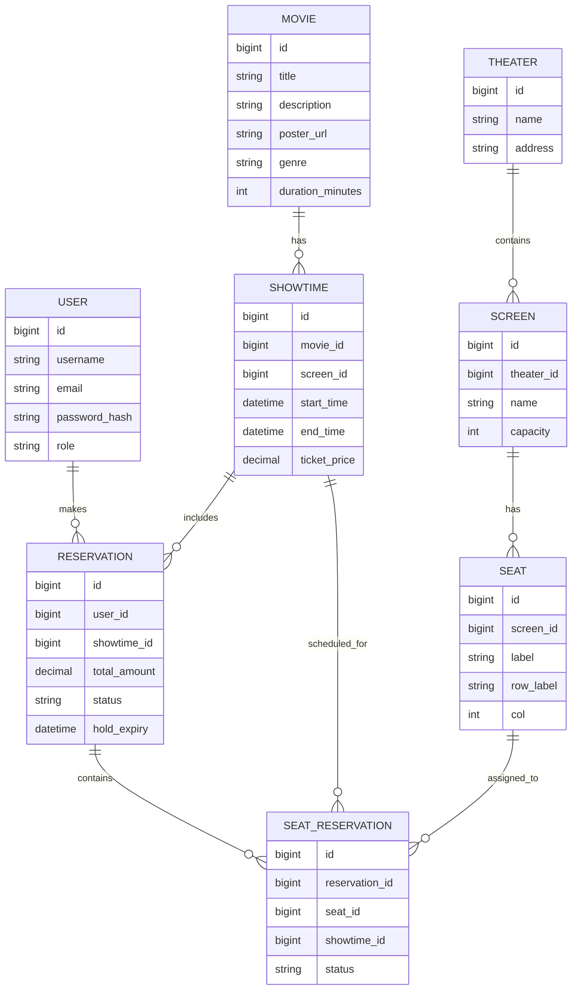

# 🎟 Movie Reservation System

## 📌 Overview

A backend service that allows users to reserve movie tickets. Features include:

- User authentication and authorization
- Movie & showtime management (Admin)
- Seat reservation with concurrency control
- Reservation management and reporting

---

## 🎯 Learning Roadmap

### Phase 1: Foundation & Setup (Week 1)

**Learning Goals:** Spring Boot basics, project structure, database setup

1. **Project Initialization**

   - Set up Spring Boot project with dependencies
   - Configure PostgreSQL connection
   - Set up Flyway for database migrations
   - Create basic project structure (packages, configs)

2. **Database Design Implementation**

   - Implement Flyway migrations for all tables
   - Test database connections and migrations
   - Understand the ER relationships

3. **Basic Configuration**
   - Application properties setup
   - Logging configuration
   - Basic error handling

### Phase 2: Core Entities & Data Layer (Week 2)

**Learning Goals:** JPA/Hibernate, repository patterns, data validation

1. **Entity Classes**

   - Create all JPA entities with proper relationships
   - Implement validation annotations
   - Add audit fields (created_at, updated_at)
   - Test entity mappings

2. **Repository Layer**

   - Create Spring Data JPA repositories
   - Implement custom query methods
   - Add pagination and sorting support

3. **Service Layer Foundation**
   - Create basic CRUD services
   - Implement business logic validation
   - Add exception handling

### Phase 3: Authentication & Security (Week 3)

**Learning Goals:** Spring Security, JWT, role-based access control

1. **User Management**

   - User registration and login
   - Password hashing with BCrypt
   - Email validation

2. **JWT Implementation**

   - JWT token generation and validation
   - Token refresh mechanism
   - Security configuration

3. **Authorization**
   - Role-based access control (USER vs ADMIN)
   - Method-level security
   - API endpoint protection

### Phase 4: Core Business Logic (Week 4)

**Learning Goals:** Complex business rules, transaction management

1. **Movie & Showtime Management**

   - Movie CRUD operations (Admin)
   - Showtime scheduling with conflict detection
   - Date/time validation

2. **Seat Management**

   - Seat availability checking
   - Screen and theater management
   - Seat layout generation

3. **Reservation Logic**
   - Basic reservation creation
   - Reservation status management
   - User reservation history

### Phase 5: Concurrency & Advanced Features (Week 5)

**Learning Goals:** Database transactions, locking, race condition prevention

1. **Concurrency Control**

   - Implement pessimistic locking
   - Handle seat reservation conflicts
   - Transaction isolation levels

2. **Reservation Flow**

   - Hold reservation mechanism
   - Expiry handling with scheduled jobs
   - Payment confirmation flow

3. **Overbooking Prevention**
   - Database constraints
   - Application-level validation
   - Conflict resolution strategies

### Phase 6: API Development (Week 6)

**Learning Goals:** RESTful API design, request/response handling

1. **Controller Layer**

   - Implement all REST endpoints
   - Request/response DTOs
   - Input validation

2. **API Documentation**

   - Swagger/OpenAPI setup
   - API documentation
   - Postman collection

3. **Error Handling**
   - Global exception handling
   - Custom error responses
   - Validation error messages

### Phase 7: Testing & Quality Assurance (Week 7)

**Learning Goals:** Testing strategies, test coverage, integration testing

1. **Unit Testing**

   - Service layer tests
   - Repository tests
   - Utility method tests

2. **Integration Testing**

   - API endpoint tests
   - Database integration tests
   - Security tests

3. **Performance Testing**
   - Load testing for concurrent reservations
   - Database performance optimization
   - Memory and CPU profiling

### Phase 8: Advanced Features & Optimization (Week 8)

**Learning Goals:** Performance optimization, monitoring, deployment

1. **Reporting & Analytics**

   - Admin reports implementation
   - Revenue and capacity reports
   - Data aggregation queries

2. **Performance Optimization**

   - Database indexing
   - Query optimization
   - Caching strategies

3. **Monitoring & Logging**
   - Application monitoring
   - Structured logging
   - Health checks

### Phase 9: Deployment & DevOps (Week 9)

**Learning Goals:** Containerization, CI/CD, production deployment

1. **Containerization**

   - Docker setup
   - Docker Compose for local development
   - Production Docker configuration

2. **CI/CD Pipeline**

   - GitHub Actions setup
   - Automated testing
   - Deployment automation

3. **Production Readiness**
   - Environment configuration
   - Security hardening
   - Backup strategies

### Phase 10: Documentation & Knowledge Sharing (Week 10)

**Learning Goals:** Technical writing, project documentation

1. **Code Documentation**

   - JavaDoc comments
   - Architecture documentation
   - API documentation

2. **Project Documentation**

   - Setup instructions
   - Deployment guide
   - Troubleshooting guide

3. **Learning Reflection**
   - Document key learnings
   - Identify areas for improvement
   - Plan next steps

---

## 📚 Key Learning Concepts

### Core Spring Boot Concepts

- **Dependency Injection:** Understanding `@Autowired`, `@Component`, `@Service`, `@Repository`
- **Spring Data JPA:** Entity relationships, repository interfaces, custom queries
- **Spring Security:** Authentication, authorization, JWT implementation
- **Transaction Management:** `@Transactional`, isolation levels, propagation
- **RESTful APIs:** Controller design, request/response handling, validation

### Database & Concurrency

- **PostgreSQL:** Advanced features, indexing, performance tuning
- **Flyway Migrations:** Version control for database schema
- **Concurrency Control:** Pessimistic vs optimistic locking, race conditions
- **ACID Properties:** Understanding transactions and data consistency

### Advanced Patterns

- **Repository Pattern:** Data access abstraction
- **Service Layer Pattern:** Business logic encapsulation
- **DTO Pattern:** Data transfer objects for API communication
- **Exception Handling:** Global exception handling, custom exceptions
- **Validation:** Bean validation, custom validators

### Testing Strategies

- **Unit Testing:** JUnit 5, Mockito, testing business logic
- **Integration Testing:** `@SpringBootTest`, database testing
- **Test Coverage:** Measuring and improving test coverage
- **Performance Testing:** Load testing, stress testing

---

## 🎯 Learning Resources

### Official Documentation

- [Spring Boot Reference Documentation](https://docs.spring.io/spring-boot/docs/current/reference/html/)
- [Spring Data JPA Documentation](https://docs.spring.io/spring-data/jpa/docs/current/reference/html/)
- [Spring Security Reference](https://docs.spring.io/spring-security/reference/)
- [Flyway Documentation](https://flywaydb.org/documentation/)

### Key Books & Courses

- **Spring Boot in Action** by Craig Walls
- **Spring Microservices in Action** by John Carnell
- **Database Design for Mere Mortals** by Michael Hernandez
- **Java Concurrency in Practice** by Brian Goetz

### Online Resources

- [Baeldung Spring Tutorials](https://www.baeldung.com/spring-tutorials)
- [Spring Guides](https://spring.io/guides)
- [PostgreSQL Tutorial](https://www.postgresqltutorial.com/)
- [JWT.io](https://jwt.io/) for JWT understanding

### Tools & IDEs

- **IntelliJ IDEA** (recommended) or **Eclipse** with Spring Tool Suite
- **Postman** for API testing
- **pgAdmin** for PostgreSQL management
- **Docker Desktop** for containerization

---

## 🚀 Getting Started Checklist

### Prerequisites

- [ ] Java 17+ installed
- [ ] Maven or Gradle build tool
- [ ] PostgreSQL database
- [ ] IDE with Spring Boot support
- [ ] Git for version control

### Initial Setup

- [ ] Create Spring Boot project (Spring Initializr)
- [ ] Configure database connection
- [ ] Set up Flyway migrations
- [ ] Create basic project structure
- [ ] Test database connectivity

### Development Environment

- [ ] Configure application.properties
- [ ] Set up logging
- [ ] Create basic health check endpoint
- [ ] Test application startup

---

## 🎯 Success Metrics

### Technical Skills

- [ ] Can explain Spring Boot architecture
- [ ] Understands JPA/Hibernate relationships
- [ ] Implements proper security measures
- [ ] Handles concurrent access correctly
- [ ] Writes comprehensive tests

### Project Completion

- [ ] All API endpoints working
- [ ] Database migrations successful
- [ ] Authentication/authorization functional
- [ ] Seat reservation concurrency handled
- [ ] Admin features implemented
- [ ] Application deployed and running

### Learning Outcomes

- [ ] Can design similar systems
- [ ] Understands trade-offs in design decisions
- [ ] Can optimize performance
- [ ] Knows how to handle production issues
- [ ] Can mentor others on the technology stack

---

## 🛠 Tech Stack

- **Backend:** Spring Boot (Java, Spring Data JPA, Spring Security)
- **Database:** PostgreSQL
- **Authentication:** JWT
- **Concurrency Control:** Pessimistic locking + DB constraints
- **Migrations:** Flyway

---

## 📊 ER Diagram



## Databse Schema

```
CREATE TABLE users (
  id BIGSERIAL PRIMARY KEY,
  username VARCHAR(100) UNIQUE NOT NULL,
  email VARCHAR(255) UNIQUE NOT NULL,
  password_hash VARCHAR(255) NOT NULL,
  role VARCHAR(20) NOT NULL DEFAULT 'ROLE_USER',
  created_at timestamptz DEFAULT now()
);

CREATE TABLE movies (
  id BIGSERIAL PRIMARY KEY,
  title VARCHAR(255) NOT NULL,
  description TEXT,
  poster_url TEXT,
  duration_minutes INT,
  genre VARCHAR(100),
  created_at timestamptz DEFAULT now()
);

CREATE TABLE theaters (
  id BIGSERIAL PRIMARY KEY,
  name VARCHAR(255) NOT NULL,
  address TEXT
);

CREATE TABLE screens (
  id BIGSERIAL PRIMARY KEY,
  theater_id BIGINT REFERENCES theaters(id) ON DELETE CASCADE,
  name VARCHAR(100),
  capacity INT NOT NULL
);

CREATE TABLE seats (
  id BIGSERIAL PRIMARY KEY,
  screen_id BIGINT REFERENCES screens(id) ON DELETE CASCADE,
  label VARCHAR(16) NOT NULL,
  row_label VARCHAR(8),
  col INT,
  UNIQUE(screen_id, label)
);

CREATE TABLE showtimes (
  id BIGSERIAL PRIMARY KEY,
  movie_id BIGINT REFERENCES movies(id) ON DELETE CASCADE,
  screen_id BIGINT REFERENCES screens(id) ON DELETE CASCADE,
  start_time timestamptz NOT NULL,
  end_time timestamptz NOT NULL,
  ticket_price NUMERIC(10,2) NOT NULL,
  created_at timestamptz DEFAULT now()
);

CREATE TABLE reservations (
  id BIGSERIAL PRIMARY KEY,
  user_id BIGINT REFERENCES users(id) ON DELETE SET NULL,
  showtime_id BIGINT REFERENCES showtimes(id) ON DELETE CASCADE,
  total_amount NUMERIC(10,2) NOT NULL DEFAULT 0,
  status VARCHAR(20) NOT NULL,
  hold_expiry timestamptz,
  created_at timestamptz DEFAULT now()
);

CREATE TABLE seat_reservations (
  id BIGSERIAL PRIMARY KEY,
  reservation_id BIGINT REFERENCES reservations(id) ON DELETE CASCADE,
  seat_id BIGINT REFERENCES seats(id) ON DELETE CASCADE,
  showtime_id BIGINT REFERENCES showtimes(id) ON DELETE CASCADE,
  status VARCHAR(20) NOT NULL,
  UNIQUE(showtime_id, seat_id)
);
```

## 📡 API Design

```
Authentication

POST /api/auth/signup — Register user

POST /api/auth/login — Login and get JWT

User

GET /api/movies?date=YYYY-MM-DD

GET /api/movies/{id}

GET /api/showtimes/{id}/seats

POST /api/showtimes/{id}/reserve

POST /api/reservations/{id}/confirm

DELETE /api/reservations/{id}

GET /api/users/{id}/reservations

Admin

POST /api/admin/movies

PUT /api/admin/movies/{id}

DELETE /api/admin/movies/{id}

POST /api/admin/showtimes

GET /api/admin/reservations

GET /api/admin/reports/capacity

GET /api/admin/reports/revenue
```

## 🔄 Seat Reservation Flow & Concurrency

```
Fetch seat availability (GET /showtimes/{id}/seats)

User selects seats & sends POST /showtimes/{id}/reserve

Backend:

Start transaction

Lock selected seats (SELECT ... FOR UPDATE)

Check for conflicts

Insert seat_reservations + reservation

Commit transaction

If HELD, expire via scheduled job

Confirm reservation after payment (POST /reservations/{id}/confirm)

Overbooking Prevention

DB constraint: UNIQUE(showtime_id, seat_id)

Transactional pessimistic locking
```

## Database Design Notes

Showtime is a screening of a movie on a specific screen at a certain date/time.

Reservation is tied to one Showtime and can have multiple Seats.

SeatReservation is the join table between Reservation and Seat, with a status field (reserved, paid, cancelled).

## Flyway Migration Plan

```
CREATE TABLE user (
    id BIGSERIAL PRIMARY KEY,
    name VARCHAR(100) NOT NULL,
    email VARCHAR(255) UNIQUE NOT NULL
);

CREATE TABLE movie (
    id BIGSERIAL PRIMARY KEY,
    title VARCHAR(255) NOT NULL,
    genre VARCHAR(100),
    duration_minutes INT NOT NULL
);

CREATE TABLE theater (
    id BIGSERIAL PRIMARY KEY,
    name VARCHAR(255) NOT NULL,
    location VARCHAR(255)
);

CREATE TABLE screen (
    id BIGSERIAL PRIMARY KEY,
    name VARCHAR(50) NOT NULL,
    theater_id BIGINT NOT NULL REFERENCES theater(id) ON DELETE CASCADE
);

CREATE TABLE seat (
    id BIGSERIAL PRIMARY KEY,
    row_label VARCHAR(5) NOT NULL,
    seat_number INT NOT NULL,
    screen_id BIGINT NOT NULL REFERENCES screen(id) ON DELETE CASCADE
);

CREATE TABLE showtime (
    id BIGSERIAL PRIMARY KEY,
    start_time TIMESTAMP NOT NULL,
    movie_id BIGINT NOT NULL REFERENCES movie(id) ON DELETE CASCADE,
    screen_id BIGINT NOT NULL REFERENCES screen(id) ON DELETE CASCADE
);

CREATE TABLE reservation (
    id BIGSERIAL PRIMARY KEY,
    user_id BIGINT NOT NULL REFERENCES user(id) ON DELETE CASCADE,
    showtime_id BIGINT NOT NULL REFERENCES showtime(id) ON DELETE CASCADE,
    reservation_time TIMESTAMP DEFAULT CURRENT_TIMESTAMP
);

CREATE TABLE seatreservation (
    id BIGSERIAL PRIMARY KEY,
    reservation_id BIGINT NOT NULL REFERENCES reservation(id) ON DELETE CASCADE,
    seat_id BIGINT NOT NULL REFERENCES seat(id) ON DELETE CASCADE,
    status VARCHAR(20) NOT NULL
);
```
